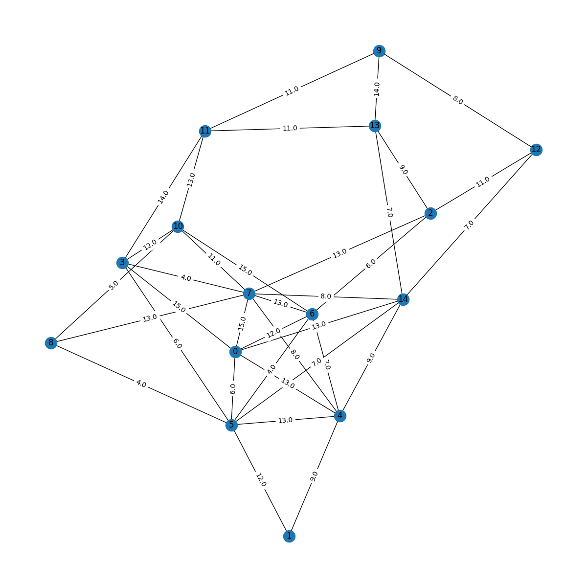

# Computer Networks Assignment 4

This repository contains the code to simulate a virtualization environment in Python as part of the Computer Networks Assignment 4.

## Description

The goal of this project is to simulate a virtualization environment and analyze the cost, duration, and acceptance ratio of different configurations. The virtual path is found via brute force, and the main optmization criterion is maximizing the acceptance ratio, with maximizing cost/revenue and number of hidden hops as a secondary goal.

## How to run the code

1. Clone this repository to your local machine.
2. Navigate to the repository directory in your terminal.
3. The main file is located in `main.py`. Can be executed with several options (run `main.py --help`).
4. The file `network.py` contains the data structure with all the corresponding methods.
5. The file `simulation.sh` is a simulation to find the dependancy of the average cost, average duration, and the acceptance ratio.
6. The executable for the report is in `assignment_4.py`. This executable contains an example of a simulation of a small network with fixed demands (files contained in Assignment_4 folder). This is the experiment that is compared with in the report to check that the project works. 
7. Also `video.py` is a file to convert the saved steps of `assignment_4.py` into a video. Works with other folder if they are saved with the same naming criterion.

## Dependencies

This project requires Python 3 and the following Python libraries:

- numpy
- networkx
- pandas
- matplotlib
- scipy
- random

You can install these libraries with pip using the command `pip install networkx`.

## Authors

- Isi Bardají
- Javier Fernández

## License

[MIT](https://choosealicense.com/licenses/mit/)